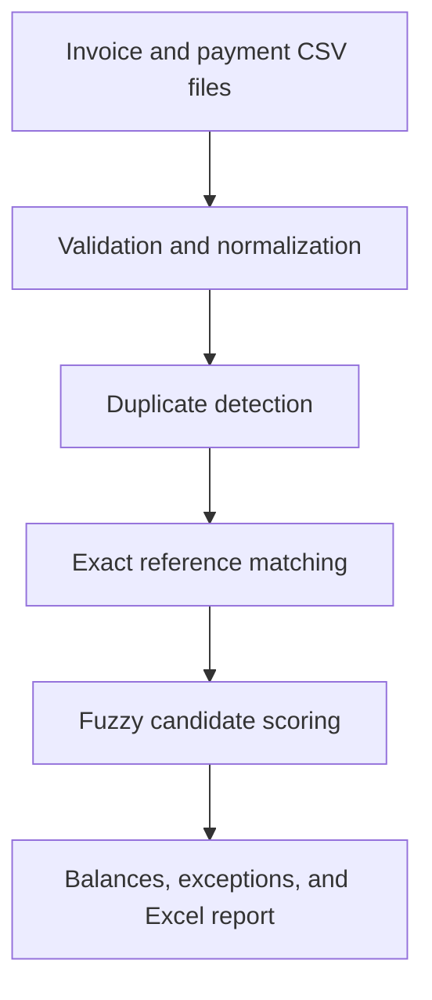

# ReconcileFlow


Automated invoice and payment reconciliation application built with Python, Pandas, RapidFuzz, Plotly, and Streamlit.

ReconcileFlow matches incoming payments to invoices, detects duplicates, identifies payment exceptions, calculates invoice balances, and generates a formatted Excel reconciliation report.

## Business problem

Businesses often receive separate invoice and bank-payment files. References may be missing, formatted differently, or contain small errors in company names.

Manual reconciliation is repetitive and can lead to:

- missed or incorrectly assigned payments;
- duplicate payment records;
- unidentified partial payments;
- unnoticed overpayments;
- time-consuming spreadsheet work.

ReconcileFlow automates the initial reconciliation process and presents exceptions for review.

## Live demo

[](https://reconcileflow-maksim2405.streamlit.app/)

[Launch the ReconcileFlow application](https://reconcileflow-maksim2405.streamlit.app/)

## Main features

- validates invoice and payment CSV structures;
- normalizes invoice references and company names;
- detects duplicate payment records;
- performs exact invoice-reference matching;
- uses fuzzy company-name matching for missing references;
- compares payment amounts and transaction dates;
- applies configurable matching thresholds;
- identifies matched, partially paid, overpaid, and unpaid invoices;
- lists unmatched and duplicate payments;
- displays KPI cards and interactive Plotly charts;
- exports results to a formatted multi-sheet Excel report;
- includes automated tests for the reconciliation engine.

## Reconciliation workflow



## Matching logic

Payments are processed in several stages.

### 1. Duplicate detection

A payment is treated as a duplicate when these fields are repeated:

- payment date;
- normalized reference;
- normalized payer name;
- payment amount;
- currency.

The first record is retained, while additional records are reported separately.

### 2. Exact reference matching

References are converted to uppercase and punctuation is removed.

For example:

```text
INV-1003 → INV1003
inv 1003 → INV1003
```

This allows differently formatted references to match the same invoice.

### 3. Fuzzy candidate matching

Payments without a valid invoice reference are compared with outstanding invoices in the same currency.

| Scoring component | Weight |
|---|---:|
| Company-name similarity | 50% |
| Payment-amount similarity | 35% |
| Payment-date proximity | 15% |

Default decision thresholds:

| Total score | Decision |
|---|---|
| 80 or higher | Suggested Match |
| 60–79.99 | Manual Review |
| Below 60 | No Match |

Thresholds can be adjusted in the Streamlit sidebar.

## Reconciliation statuses

| Status | Meaning |
|---|---|
| Matched | Paid amount equals the invoice amount |
| Partial Payment | Invoice still has an outstanding balance |
| Overpayment | Paid amount exceeds the invoice amount |
| Unpaid Invoice | No payment has been assigned |

## Sample results

The included sample data produces the following result:

| Metric | Result |
|---|---:|
| Total invoices | 10 |
| Total invoice value | 11,315.00 |
| Assigned payment value | 10,595.00 |
| Matched invoices | 7 |
| Matching rate | 70% |
| Outstanding amount | 780.00 |
| Overpayment amount | 60.00 |
| Duplicate payments | 1 |
| Unmatched payments | 1 |

The sample demonstrates:

- exact reference matching;
- differently formatted references;
- fuzzy company-name matching;
- partial payments;
- multiple payments for one invoice;
- an overpayment;
- a duplicate payment;
- an unmatched payment;
- an unpaid invoice.

## Required CSV columns

### Invoice file

| Column | Description |
|---|---|
| `invoice_id` | Unique invoice identifier |
| `customer_name` | Customer or company name |
| `invoice_date` | Invoice issue date |
| `due_date` | Invoice due date |
| `invoice_amount` | Invoice value |
| `currency` | Currency code |

### Payment file

| Column | Description |
|---|---|
| `payment_id` | Unique payment identifier |
| `payment_date` | Payment date |
| `reference` | Invoice or transaction reference |
| `payer_name` | Payer or company name |
| `payment_amount` | Payment value |
| `currency` | Currency code |

Example files are available in the [`sample_data`](sample_data) directory.

## Excel report

The application generates `reconcileflow_report.xlsx` with these sheets:

1. KPI Summary
2. Reconciliation
3. Payment Assignments
4. Match Candidates
5. Unmatched Payments
6. Duplicate Payments

The workbook includes filters, formatted dates and amounts, adjusted column widths, and color-coded reconciliation statuses.

## Project structure

```text
reconcileflow/
├── .streamlit/
│   └── config.toml
├── sample_data/
│   ├── sample_invoices.csv
│   └── sample_payments.csv
├── tests/
│   └── test_reconcile_engine.py
├── app.py
├── reconcile_engine.py
├── requirements.txt
├── requirements-dev.txt
└── README.md
```

## Run locally

Clone the repository:

```bash
git clone https://github.com/Maksim2405/reconcileflow.git
cd reconcileflow
```

Install application dependencies:

```bash
pip install -r requirements.txt
```

Start the application:

```bash
streamlit run app.py
```

## Run tests

Install development dependencies:

```bash
pip install -r requirements-dev.txt
```

Run the test suite:

```bash
pytest -q
```

Expected result:

```text
5 passed
```

## Technologies

- Python
- Pandas
- NumPy
- RapidFuzz
- Plotly
- Streamlit
- XlsxWriter
- Pytest

## Limitations

ReconcileFlow is a portfolio demonstration and an initial reconciliation tool. Suggested fuzzy matches should be reviewed before results are used in accounting or financial systems.

The application does not connect directly to banking or accounting APIs and does not modify source files.

## Author

**Maksim Radin**

[GitHub profile](https://github.com/Maksim2405)

## License

This project is available under the MIT License.
